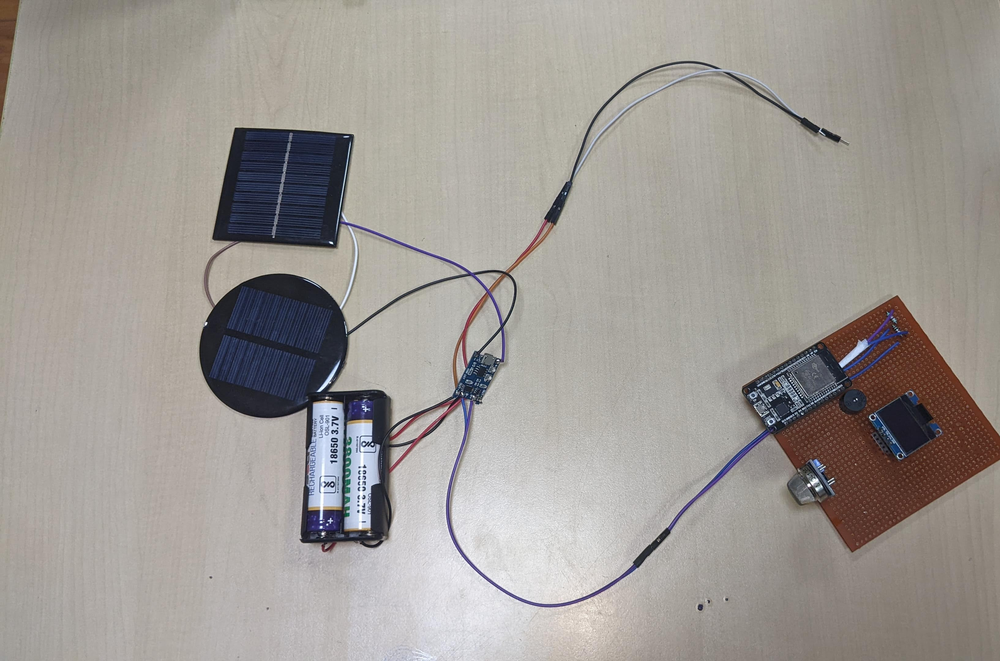

# Project Shunya - A Zero Power Home Security and Automation System

- Mini Project for Sensor Technology, ICE2129.
- Implemented an entire Home Automation and Security Sensor, on a Zero Carbon footprint, using ESP-IDF.
- MQ135 sensor warns the occupant if there is a fire or harmful smoke rising in the house, PIR Sensors gives the status of people occupying a room.
- The ESP also hosts a dashboard which updates in real time, with a 3 second delay.

## Electronics and Sensors used

- ESP32
- Solar Panels
- TP4056
- 3.7v Li-Ion Batteries
- OLED Sensor
- MQ135
- PIR Sensor
- Active buzzer
